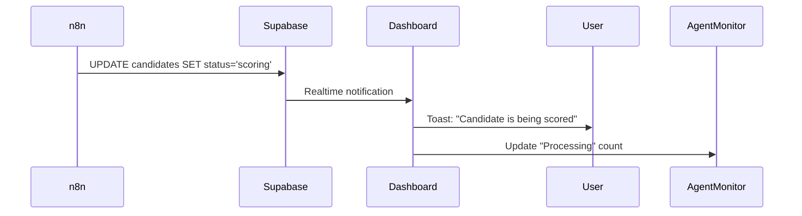
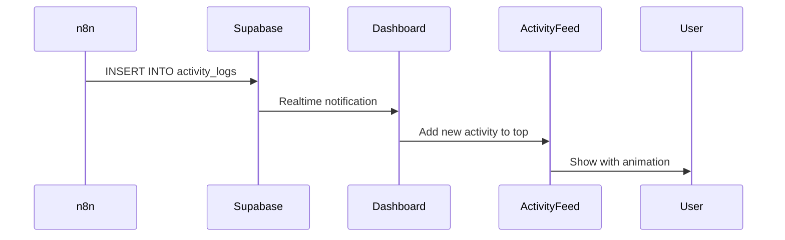

# Real-time Dashboard System

## Overview

The Haigent platform now features a complete real-time monitoring system that tracks candidate progress, agent activity, and sends notifications for important events.

## Architecture

```
┌─────────────────────────────────────────────────────────────┐
│                      N8N Workflow                           │
│  (Scores candidates, schedules interviews, sends emails)    │
└──────────────────┬──────────────────────────────────────────┘
                   │
                   │ Writes to
                   ▼
┌─────────────────────────────────────────────────────────────┐
│                   Supabase Database                          │
│  • candidates table (status changes trigger notifications)  │
│  • interviews table (real-time interview tracking)          │
│  • activity_logs table (agent action history)               │
└──────────────────┬──────────────────────────────────────────┘
                   │
                   │ Realtime subscriptions
                   ▼
┌─────────────────────────────────────────────────────────────┐
│                  React Hooks Layer                          │
│  • useRealtimeCandidates()                                  │
│  • useRealtimeInterviews()                                  │
│  • useRealtimeActivity()                                    │
│  • useCandidateNotifications()                              │
└──────────────────┬──────────────────────────────────────────┘
                   │
                   │ Renders
                   ▼
┌─────────────────────────────────────────────────────────────┐
│                  Dashboard Components                        │
│  • Agent Status Monitor (shows what agent is doing)         │
│  • Real-time Activity Feed (shows recent actions)           │
│  • Toast Notifications (alerts for important events)        │
└─────────────────────────────────────────────────────────────┘
```

## Features

### 1. **Agent Status Monitor**
- Shows current agent state (Processing / Idle)
- Displays candidates being processed
- Pipeline progress visualization
- Breakdown by candidate status

**Location:** `/schedule` dashboard
**Component:** `AgentStatusMonitor`

### 2. **Real-time Activity Feed**
- Live stream of agent actions
- Auto-scrolling feed
- Timestamped entries
- Action-specific icons and colors

**Location:** `/schedule` dashboard
**Component:** `RealTimeActivityFeed`

### 3. **Toast Notifications**
- Popup notifications for key events:
  - New application received
  - Candidate scored
  - Interview scheduled
  - Candidate hired/rejected

**Implementation:** `useCandidateNotifications()` hook

## Components

### Hooks

| Hook | Purpose | Location |
|------|---------|----------|
| `useRealtimeCandidates` | Subscribe to candidate changes | `/hooks/use-realtime-candidates.ts` |
| `useRealtimeInterviews` | Subscribe to interview changes | `/hooks/use-realtime-interviews.ts` |
| `useRealtimeActivity` | Subscribe to activity logs | `/hooks/use-realtime-activity.ts` |
| `useCandidateNotifications` | Show toast on status changes | `/hooks/use-candidate-notifications.ts` |

### Components

| Component | Purpose | Location |
|-----------|---------|----------|
| `AgentStatusMonitor` | Display agent state | `/components/schedule/dashboard/agent-status-monitor.tsx` |
| `RealTimeActivityFeed` | Show activity stream | `/components/schedule/dashboard/real-time-activity-feed.tsx` |
| `RealtimeDashboardWrapper` | Wrapper with notifications | `/components/schedule/dashboard/realtime-dashboard-wrapper.tsx` |
| `ToastProvider` | Toast notification provider | `/components/providers/toast-provider.tsx` |

## How It Works

### 1. Candidate Status Changes



### 2. Activity Logging



## Notification Types

| Candidate Status | Notification | Type |
|-----------------|--------------|------|
| `applied` | "New Application" | Info |
| `scoring` | "AI Scoring" | Info |
| `scored` | "Scoring Complete" | Success |
| `invited` | "Interview Invitation" | Success |
| `scheduled` | "Interview Scheduled" | Success |
| `interviewed` | "Interview Complete" | Info |
| `hired` | "Candidate Hired! 🎉" | Success |
| `rejected` | "Candidate Rejected" | Warning |

## Scaling to Other Agents

This system is designed to support multiple Haigent agents (Sourcing, Reference, Onboarding, etc.). Here's how to add a new agent:

### Step 1: Define Agent-Specific Actions

Add new action types to `lib/types/index.ts`:

```typescript
export type ActivityAction =
  | 'job.created'
  | 'candidate.applied'
  // ... existing actions
  | 'sourcing.search_started'      // New agent actions
  | 'sourcing.candidates_found'
  | 'sourcing.outreach_sent'
  | 'reference.check_initiated'
  | 'reference.check_completed';
```

### Step 2: Create Agent-Specific Components

```typescript
// components/sourcing/dashboard/agent-status-monitor.tsx
export function SourcingAgentMonitor() {
  const { activities } = useRealtimeActivity();

  // Filter for sourcing-related activities
  const sourcingActivities = activities.filter(
    a => a.action.startsWith('sourcing.')
  );

  // ... render sourcing-specific UI
}
```

### Step 3: Add N8N Integration

In your new agent's n8n workflow, add Supabase Insert nodes:

```json
{
  "action": "sourcing.candidates_found",
  "entity_type": "candidate",
  "metadata": {
    "platform": "LinkedIn",
    "candidates_count": 25,
    "search_criteria": "Full-stack engineer in SF"
  }
}
```

### Step 4: Update Dashboard

Add the new agent monitor to the agent's dashboard:

```typescript
// app/(dashboard)/sourcing/page.tsx
import { SourcingAgentMonitor } from "@/components/sourcing/dashboard/agent-status-monitor";

export default function SourcingDashboard() {
  return (
    <div>
      <SourcingAgentMonitor />
      {/* other components */}
    </div>
  );
}
```

## Performance Considerations

- **Subscription Management**: Each hook automatically cleans up subscriptions on unmount
- **Activity Limit**: Activity feed limits to 10-15 recent items to prevent memory issues
- **Debouncing**: Status updates are batched by Supabase Realtime to reduce network calls

## Testing

### Manual Testing
1. Create a job posting
2. Submit a candidate application via webhook
3. Watch the dashboard:
   - Agent Status Monitor should show "Processing"
   - Activity Feed should show "Candidate scored"
   - Toast notification should appear
   - Agent Status should return to "Idle" when complete

### Automated Testing
```bash
# Test webhook endpoint
curl -X POST http://localhost:54321/functions/v1/process-application \
  -H "Content-Type: application/json" \
  -d '{"candidate_id": "..."}'
```

## Troubleshooting

### Notifications Not Appearing
- Check browser console for errors
- Verify `ToastProvider` is in root layout
- Ensure Supabase Realtime is enabled in project settings

### Activity Feed Empty
- Verify n8n workflows are logging to `activity_logs` table
- Check Supabase for INSERT permissions on `activity_logs`
- Check browser console for subscription errors

### Agent Status Stuck on "Processing"
- Check if candidate status is actually updating
- Verify `status` field in candidates table
- Look for errors in n8n workflow execution logs

## Future Enhancements

- [ ] Agent performance metrics (avg processing time, success rate)
- [ ] Historical activity search and filtering
- [ ] Export activity logs to CSV
- [ ] Agent pause/resume controls
- [ ] Webhook health monitoring
- [ ] Real-time candidate chat/messaging
- [ ] Multi-agent orchestration dashboard
